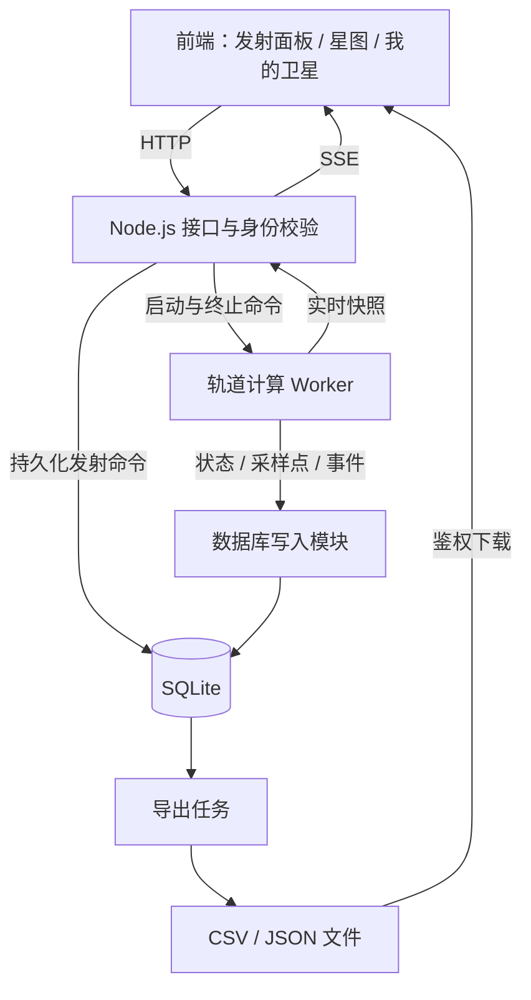

# ORBITAL 卫星持续模拟与轨迹归档方案

日期：2026-09-16  
状态：设计方案，尚未实施后端改造。  
适用项目：`D:\Codex\orbital`

**目标：** 用户指定坐标、质量、初速度和方向发射卫星；服务器持续模拟其运动，记录存活时间及完整生命周期的轨迹，支持跨会话查看、回放和导出。

**架构：** 浏览器负责参数输入、预览和显示；Node.js 后端接受发射并管理卫星；独立计算工作线程推进轨道；数据库持久化档案、轨迹和恢复状态。服务器计算结果是正式记录的唯一来源。

**技术组合：** 保留原生 HTML/CSS/Canvas/JavaScript 前端，增加 Node.js、计算 Worker、SQLite、本地持久化文件目录。第一版部署在一台常驻服务器，不引入多台计算节点和消息队列。

**需求依据：** 本文同时作为产品需求与技术设计。分阶段实施清单在第 13 节。后续开发按阶段执行、逐项验证；本次仅交付方案文档。

## 1. 为什么需要后端

仅靠前端，无法在用户关闭浏览器、设备休眠或更换设备后持续、可靠地计算轨道和保存历史。

Node.js 是运行在服务器上的 JavaScript 环境，可以处理 HTTP 请求、调用数据库、管理后台任务，并复用现有 JavaScript 轨道算法。前端与后端虽然使用相同语言，但运行位置、职责和生命周期不同。

需要一台持续运行的服务器。开发时可以在本机运行；电脑关机后本机服务也会停止。正式使用应部署到常驻主机，并配备自动重启、持久化磁盘和备份。

## 2. 当前项目基础与需要改变的部分

| 文件或功能 | 当前情况 | 改造方向 |
| --- | --- | --- |
| `physics.js` | 二维伪牛顿引力、固定积分步长、三种速度预设 | 拆出可复用计算核心，接受任意初始速度向量，支持序列化与恢复 |
| `camera.js` | 世界坐标和屏幕坐标转换，10%–200% 缩放 | 继续复用；输入坐标不受镜头倍率影响 |
| `interactions.js` | 浏览器创建星体、推进状态、绘制尾迹 | 正式发射改为后端请求；绘制后端快照；保留独立的本地预览 |
| `app.js` | 动画帧推动物理时间，暂停与速度影响本地模拟 | 拆分装饰动画、实时观察和历史回放的时间控制 |
| 轨迹 | 每颗星只保留最近 70 个采样点 | 显示尾迹继续限制长度，历史轨迹单独完整归档 |
| 质量 | 目前主要影响光点尺寸 | 记录真实输入值，视觉尺寸使用独立映射 |
| 状态 | 捕获或逃逸后从内存移除 | 保存终态、终止位置和事件，不删除档案 |
| `physics.test.cjs`、`camera.test.cjs` | 已有守恒量、捕获、逃逸、坐标转换测试 | 作为回归基础，增加恢复、持久化和接口测试 |

当前模型不是完整广义相对论模拟。吸积盘、黑色阴影和光波包含美术效果，不能把画面中的黑色边缘直接当作物理死亡边界。

## 3. 第一版范围

第一版包含：

- 二维坐标、质量、初速度、方向输入，以及鼠标选点、方向箭头和参数预设。
- 发射前的短时轨迹预览，正式发射后获得唯一卫星编号。
- 用户身份与“我的卫星”列表，可回到自己的历史记录。
- 浏览器关闭后，服务器继续计算已发射卫星。
- 运行状态、存活时长、吞噬及逃逸事件。
- 服务重启后恢复状态，并补算停机期间的模拟进度。
- 从出生到当前或终止的轨迹查询、历史回放、CSV/JSON 导出。
- 部署、备份、状态监测与故障恢复验证。

第一版不包含三维轨道、卫星之间的相互引力、碰撞碎片、推进器、燃料、黑洞自旋、真实潮汐破坏或完整相对论测地线。卫星相互独立，但可在同一个观察画面中展示。

“发射次数不设置产品层面的累计上限”可以保留。服务器计算量和历史存储仍受硬件约束；系统繁忙时明确排队或拒绝新增任务，不静默丢弃已有卫星或历史记录。

## 4. 用户使用流程

1. 用户进入发射页面：左侧为参数面板，右侧为黑洞星图与发射预览。
2. 在左侧填写世界坐标 `x、y`，右侧立即在对应位置显示卫星十字定位标记；也可以点击右侧星图反向填写坐标。
3. 在左侧输入卫星名称、质量、速度大小和方向角度。
4. 右侧以十字定位标记为起点显示方向箭头，随左侧角度输入同步旋转；同时查看当前位置的参考圆轨道速度和逃逸速度。
5. 可请求短时预览，预览标注“预测”，不创建正式卫星。
6. 点击“正式发射”，后端校验并持久化出生档案，返回卫星编号和正式出生时刻。
7. 在“我的卫星”中查看运行状态、存活时长和实时位置。
8. 关闭页面后服务器继续运行。再次访问时先读取最新状态，再接收实时更新。
9. 进入卫星详情，按时间回放轨迹，导出当前已有的完整记录。

“清空画面”只隐藏观察对象，不停止服务器模拟、不删除轨迹。“终止追踪”是独立操作，记录结束原因并保留档案。

### 4.1 左侧参数与右侧卫星定位联动

桌面采用左右布局：左侧是固定操作区域，右侧是可缩放星图。手机采用上方参数、下方星图，保持相同联动规则。

| 左侧操作 | 右侧即时反馈 |
| --- | --- |
| 修改 X 或 Y 坐标 | 卫星十字定位标记移动到对应世界坐标，旁边显示名称及坐标 |
| 修改方向角度 | 从十字中心伸出的箭头同步旋转，标注当前角度 |
| 修改初速度 | 更新箭头旁的速度数值，以及启用中的预测轨迹 |
| 选择掠入、环绕或逃逸预设 | 回填速度和方向输入框，同步更新箭头与预测轨迹 |
| 在右侧点击一个位置 | 十字定位标记移动到点击处，并将转换后的世界坐标回填左侧 |
| 调整视野缩放 | 黑洞和定位点按同一世界坐标变换绘制，左侧坐标与角度数值不变 |

具体交互规则：

- 有效坐标输入后立即展示十字定位，不必点击“正式发射”，也不创建后台卫星。
- 十字标记和方向箭头标注“待发射”，与正在运行的卫星区分；整个发射草稿只显示一个定位标记，修改参数不会遗留旧标记。
- 箭头方向由世界坐标速度向量投影得到，使用与星图相同的倾角和缩放。当前斜视星图中，屏幕上的箭头角度不一定等于输入数值；角度标签始终显示轨道平面内的用户输入角度。
- 第一版箭头采用固定可读的屏幕长度，速度用数值表达，避免大速度让箭头超出画面。零初速度时保留十字和“静止释放”提示，隐藏运动箭头。
- 十字线宽、箭头头部和文字保持可读尺寸；放大缩小不会改变用户填写的物理参数。
- 输入位置超出当前视野时显示“定位点在视野外”和“定位卫星”按钮。定位操作调整观察视野，不改写坐标、不移动实际出生位置。
- 输入为空、非数值或超出模型允许范围时，在对应字段提示，禁用正式发射，并隐藏无效草稿标记，避免旧位置被误认为当前输入结果。
- 输入位置在捕获面内时显示明确错误定位样式并禁止发射；不自动把卫星搬到另一条轨道。
- 仅点击“正式发射”才提交左侧当前有效参数；提交期间锁定该次请求参数，成功后右侧切换为服务器确认的正式卫星。

验收示例：输入 `(600, 0)` 和 `90°`，右侧十字定位在该坐标，箭头指向轨道平面的 +Y 方向；把角度改为 `180°`，十字位置不变，箭头改为指向 -X。缩放星图后输入框仍为 `(600, 0)` 和 `180°`。

## 5. 参数、坐标与物理规则

### 5.1 参数定义

| 参数 | 定义与第一版规则 |
| --- | --- |
| 名称 | 1–64 个字符，用于列表和导出文件标识 |
| 坐标 `x、y` | 黑洞中心为 `(0,0)`，轨道平面上向右为 +X、向上为 +Y |
| 质量 `massKg` | 有限正数，单位 kg；第一版作为卫星属性存档 |
| 速度 `speed` | 有限非负数，单位为场景长度/模拟秒 |
| 方向 `directionDeg` | +X 为 0°，逆时针增加；提交后归一化到 `[0,360)` |
| 黑洞参数 | 由服务器提供模型配置，第一版不让每次发射改变公共黑洞参数 |

速度转换为：

```text
vx = speed × cos(directionDeg × π / 180)
vy = speed × sin(directionDeg × π / 180)
```

现有渲染使用 Canvas 的 Y 轴约定。增加用户坐标转换层：输入与导出的 +Y 向上，与现有绘图坐标之间显式转换；不能直接把 Canvas 像素坐标作为物理坐标。

所有数值在后端重新校验。禁止 NaN、Infinity、非正质量和捕获面内出生。坐标与速度的可接受范围由经过数值测试的模型配置给出，前端读取后显示；不接受超出已验证范围的任意大数。方向为零、速度为零和径向发射均应有测试覆盖。

第一版沿用场景单位，不能把当前数值直接标为 km 或 km/s。若支持真实单位，应同时定义长度、时间、中心质量及其换算，并使 `GM` 和史瓦西半径保持物理一致。2026-09-16 的实施修订见文末“科学单位与持续追踪”，该修订覆盖第一版的单位和逃逸结束规则。

### 5.2 引力模型

第一版沿用现有 Paczyński–Wiita 伪牛顿势：

```text
Φ(r) = -GM / (r - rs)
a = -GM × r_vector / [r × (r - rs)²]
```

现有参数为 `GM=2000000`、`rs=66`，捕获面为 `1.05rs`。现有积分器采用固定 `1/240` 模拟秒的 velocity Verlet 步进，作为第一版基线；上线前需对新增的速度与坐标范围做精度验证。

卫星作为测试粒子，不影响黑洞和其他卫星。因此不同质量的卫星，如果坐标和初速度相同，运动轨迹相同。不能通过让重卫星“受到更大加速度”来制造质量差异。

“掠入、环绕、逃逸”保留为填写初始参数的快捷方式，不覆盖用户手动输入。环绕预设只给出模型对应的切向初速度，不强制把轨迹锁在圆环上，也不自动移动用户指定的发射坐标。

### 5.3 状态与结束条件

| 状态 | 含义 | 时长与轨迹处理 |
| --- | --- | --- |
| `queued` | 发射请求已接受，等待正式出生 | 不计入已存活时间 |
| `active` | 持续计算，尚未结束追踪 | 显示已模拟的存活时长 |
| `captured` | 越过物理捕获面 | 保存捕获时刻、交点和最后状态 |
| `escaped` | 正能量、向外运动且跨越约定追踪边界 | 保存逃逸事件；不能描述为死亡 |
| `terminated` | 用户主动终止追踪 | 保存结束时刻和原因；不能描述为被吞噬 |
| `error` | 出现非有限数值或无法可靠继续的计算异常 | 保存最后可靠状态，显示计算中断 |

逃逸边界第一版沿用 `max(1200, 初始半径×3)`，在出生时固定并写入档案，与镜头缩放无关。它是本项目的追踪结束规则，不是宇宙的物理边界。

稳定轨道可能永远没有死亡时刻。运行中的记录允许导出“出生至截止时刻”的数据，文件标注未结束。

当前捕获检测只修改状态，没有保存穿越位置。改造时必须计算步内线段与捕获圆的交点，记录事件时间；明确该时间是数值近似，并通过更小步长对照测试误差，不能把穿越前一帧位置直接当作死亡点。

## 6. 系统架构



### 6.1 前端

- 继续使用现有页面和 Canvas，无需为了后端重写成新的前端框架。
- 实时视图只展示服务器状态，必要时在快照之间插值；插值不是正式物理记录。
- 预览运行在浏览器 Worker 中，与正式卫星分开，限制预测步数和运行时间。
- 只加载当前时间窗口和可见对象，历史查询支持分段加载及降采样显示。

### 6.2 Node.js 接口服务

- 负责用户身份、参数校验、发射、查询、终止和导出。
- HTTP 用于命令与查询，SSE 用于服务器向页面推送快照；暂不需要双向 WebSocket。
- 发射请求携带幂等键，同一用户重复提交同一个键时返回同一颗卫星，避免重试产生重复发射。
- 客户端不能提交正式轨迹、存活时长或终态覆盖服务器记录。

### 6.3 计算与写入

- 第一版一个常驻计算 Worker 批量推进卫星，不给每颗卫星创建一个线程或定时器。
- 计算与接口服务分离，避免大量积分阻塞用户请求。
- 数据库由专门写入模块统一批量写入；磁盘变慢时施加背压，不能无限积累内存队列。
- 导出采用独立后台任务，分段读取数据，不能把多年轨迹一次性加载到接口进程内存。

Node.js 官方说明 Worker 适合 CPU 密集型 JavaScript 计算，复用计算工作线程比频繁创建线程更合适。参考：[Worker threads](https://nodejs.org/api/worker_threads.html)。

## 7. 时间、离线运行与故障恢复

### 7.1 时间规则

第一版服务器规定：1 秒现实经过时间对应 1 模拟秒。这里的模拟秒是模型时间单位，不代表已经标定了真实黑洞的物理时间。

- 物理计算按固定步长推进，使用整数 tick 表示进度，避免长期累加浮点时间造成漂移。
- 正常运行用单调时钟测量经过时间；定时器只用于唤醒，不能假设一次唤醒就恰好经过一个步长。
- 服务器时间倍率、模型参数和版本在一个模拟世界中固定。修改参数时创建新的模型版本/世界，不改变已有卫星的规则。
- 页面暂停只冻结观察；历史回放可快进。正式实时视图不能用用户的倍率修改后台计算。
- 存活时长等于当前已计算或终止 tick 减去出生 tick，再换算为模拟时间；排队时间不算存活时间。

### 7.2 持久化与恢复流程

1. 正式出生前，把用户、初始条件、模型版本、出生 tick 和幂等键保存成功。
2. 每个写入批次在一个事务中保存轨迹点、事件和对应检查点；建议以约 1 秒现实时间或批次大小阈值触发，以先到者为准。
3. 检查点包含位置、速度、当前 tick、采样调度状态、事件序号和世界时钟锚点。
4. 正常退出时提交最后一批数据。意外中断时，从最近一次已提交检查点恢复。
5. 根据持久化 UTC 时钟锚点计算应追赶的目标 tick，分批补算；补算结果与持续运行使用同一积分逻辑。
6. 使用唯一采样键与事件键保证重算不重复写入。尚未提交的进度可以重算，已提交的数据不能跳过或重复。
7. 页面显示“正在恢复/落后多少模拟时间”。未追赶完成时，最新位置和时长以已计算进度为准，不能假装已经到达现在。

只允许一个计算服务拥有同一世界的推进权。第一版通过单实例部署和进程锁防止双重推进；扩容前必须设计分片所有权。

长期停机可能需要较长补算时间。补算期间，新发射请求进入队列，追赶完成后才产生正式出生时刻。若发现系统时间倒退或异常跳跃，进入可见的时钟异常状态，禁止倒退模拟时间或静默吞掉时间差。

## 8. 数据结构

以下是逻辑结构，字段命名与接口一致；轨迹量较大后可把冷数据迁出数据库。

| 表 | 核心字段 | 作用 |
| --- | --- | --- |
| `users` | `id`、`created_at` | 卫星所属用户 |
| `sessions` | `id`、`user_id`、`token_hash`、`expires_at` | 可撤销的访问会话 |
| `recovery_keys` | `user_id`、`key_hash`、`created_at`、`revoked_at` | 第一版访客身份跨设备恢复 |
| `worlds` | `id`、`model_version`、`config_json`、`tick_rate`、`time_scale`、时钟锚点 | 固定规则与公共时钟 |
| `satellites` | `id`、`user_id`、`world_id`、`name`、`mass_kg`、`initial_x/y/vx/vy`、`birth_tick`、`end_tick`、`status`、`end_reason`、`escape_radius`、`idempotency_key` | 出生档案和生命周期 |
| `satellite_states` | `satellite_id`、`tick`、`x/y/vx/vy`、`sampling_state`、`event_seq` | 可恢复检查点 |
| `trajectory_points` | `satellite_id`、`tick`、`sample_seq`、`x/y/vx/vy`、`kind` | 持久化轨迹；`kind` 区分出生、常规和事件点 |
| `satellite_events` | `satellite_id`、`event_seq`、`tick`、`substep_fraction`、`type`、`payload_json` | 捕获、逃逸、终止和异常 |
| `exports` | `id`、`user_id`、`satellite_id`、`cutoff_tick`、`format`、`status`、`file_path`、`checksum`、`expires_at` | 导出任务与下载文件 |

必须设置的索引与约束：

- `satellites(user_id, created_at)`：分页查询“我的卫星”，实现时保留 `created_at` 审计时间。
- `satellites(user_id, idempotency_key)` 唯一：防止重复发射。
- `trajectory_points(satellite_id, tick, sample_seq)` 唯一：分段读取和重算去重。
- `satellite_events(satellite_id, event_seq)` 唯一：防止结束事件重复。
- `satellite_states(satellite_id)` 主键：每颗卫星一个最新可靠检查点。

坐标、速度与模型参数以双精度数值保存。原始配置和模型版本不可随服务升级覆盖；旧卫星继续使用对应版本，显式迁移时生成迁移事件。

第一版使用 SQLite WAL 模式，计算数据批量写入。WAL 支持读写并行，但同时只有一个写入者；这也是第一版采用单机和统一写入模块的原因。参考：[SQLite WAL](https://sqlite.org/wal.html)。

## 9. 轨迹记录精度与存储规模

“从出生到死亡的完整轨迹”定义为：完整覆盖整个追踪时间段，包含出生点、过程采样点和终止事件，同时披露采样间隔及事件误差；不等同于无限精度，也不默认保存每一个积分步骤。

建议起始策略：

- 积分仍使用经过验证的固定步长。
- 基础记录间隔为 1 模拟秒；近中心半径小于 `4rs` 时，每个积分步记录。
- 每次采样调度也检查轨迹转角和插值误差，超过模型配置阈值时增加采样。阈值通过对照高频轨迹的误差测试确定，随模型版本存档。
- 出生、捕获、逃逸、主动终止和异常总是记录独立事件及边界状态，不受基础采样间隔限制。
- 实时广播建议从每秒 5–10 次起步，与数据库采样频率分离；断线不影响归档。
- 前端可对远距离历史曲线降采样，但导出读取归档数据，不能把显示用的简化曲线当作原始轨迹。

容量估算：若每秒记录 1 点，每颗卫星每天产生 86,400 点。仅以每点 5 个 8 字节数值估算，原始数据约 3.46 MB/天/颗，100 颗约 346 MB/天；实际还要加上编号、索引、事务日志等开销。靠近黑洞时加密采样会显著增加数据量。

长期运行必须监测存储增长。第一版不自动删除原始轨迹；后续可把结束卫星和较老的轨迹压缩归档到对象存储，保留连续性、校验和及可下载能力。临时导出文件可过期清理，并允许从原始记录重新生成。

## 10. API 草案

接口统一置于 `/api`。下面是第一版接口边界，不代表接口已经实现。

| 方法与路径 | 用途 |
| --- | --- |
| `POST /api/session/guest` | 创建访客身份与会话，首次返回身份恢复凭证 |
| `POST /api/session/recover` | 用恢复凭证在另一设备建立会话 |
| `DELETE /api/session` | 退出并撤销当前会话 |
| `GET /api/model` | 获取模型版本、参数、单位、方向定义、可接受数值范围和服务器进度 |
| `POST /api/satellites` | 幂等创建发射请求 |
| `GET /api/satellites?cursor=...` | 分页查询当前用户卫星 |
| `GET /api/satellites/:id` | 获取档案、最新状态、寿命和结束原因 |
| `POST /api/satellites/:id/terminate` | 请求终止追踪，在指定服务器 tick 生效 |
| `GET /api/satellites/:id/trajectory?fromTick=...&toTick=...&cursor=...` | 分页查询历史采样 |
| `GET /api/stream` | 推送当前用户所订阅卫星的实时快照 |
| `POST /api/satellites/:id/exports` | 创建指定截止 tick 的导出任务 |
| `GET /api/exports/:id` | 查询导出进度、文件大小与校验和 |
| `GET /api/exports/:id/download` | 鉴权下载已完成文件 |

示例发射请求：

```json
{
  "name": "远航一号",
  "position": { "x": 600, "y": 0 },
  "massKg": 1000,
  "speed": 60,
  "directionDeg": 90,
  "modelVersion": "pw-2d-v1",
  "idempotencyKey": "用户本次操作生成的唯一键"
}
```

返回卫星 ID、当前状态、规范化初始条件、模型版本；已正式出生时同时返回 `birthTick`。排队时 `birthTick` 为空，不能从请求到达时间提前计寿命。示例参数只用于说明格式，不保证形成圆轨道。

模型版本冲突返回 409；非法参数返回 422；无身份返回 401；不属于当前用户的资源返回 404；繁忙且未接受请求时返回 503，并给出重试提示。同一幂等键对应不同请求内容时返回冲突，不能悄悄复用错误参数。

SSE 快照携带服务器 tick 和状态版本，前端忽略旧快照。重连后先重新查询权威状态；若实时快照已经过期，通过历史接口补齐，不依赖网络推送保存完整轨迹。

## 11. 导出与回放

### 11.1 导出文件

第一版支持 CSV 和 JSON，后续增加 SVG/PNG 轨迹图和视频。

CSV 建议列：

```text
satellite_id,elapsed_sim_seconds,tick,event_type,x,y,vx,vy,radius,speed
```

CSV 配套元数据文件，JSON 直接包含以下信息：

- 卫星编号、名称、质量、初始坐标和初始速度。
- 模型版本、参数、单位、坐标方向、积分方法和采样规则。
- 出生时刻、导出截止 tick、追踪状态、结束原因。
- 全部归档采样点、关键事件和数值精度说明。

每次导出固定一个已提交的 `cutoffTick`。后台继续计算时，导出内容仍保持一致，不混入截止点之后的数据。导出文件先写临时文件，完成后原子发布并计算校验和。

导出任务失败可重试，不删除原始轨迹。用户只能下载自己的卫星记录；文件名使用安全的卫星 ID，避免用户输入名称成为服务器文件路径。

### 11.2 历史回放

- 时间轴支持拖动、暂停和倍率播放。
- 根据归档点插值显示，显式标注回放模式和采样精度。
- 在捕获、逃逸等事件处定位到保存的终止状态，不越过终态继续画轨迹。
- 点击“返回实时”后同步最新服务器状态。
- 第一期导出精度以已存档采样为准；按原始初始条件重新计算更高分辨率轨迹属于后续能力，不能在模型版本不一致时声称得到原始记录。

## 12. 用户身份、部署与运维

### 12.1 身份设计

第一版采用访客身份加可保存的恢复凭证：首次访问创建用户，浏览器使用服务端会话 Cookie；用户在另一设备输入恢复凭证后可以找回自己的卫星。凭证随机生成、服务端只保存哈希，不放在下载链接或 URL 中；提供撤销/更换入口。未保存凭证又清除会话的用户可能无法找回访客数据，界面必须明确提示。

后续可把访客数据绑定到正式账号。所有查询、终止、订阅和导出都检查资源归属；写操作检查请求来源并提供 CSRF 防护。公开分享是单独功能，默认轨迹不公开。

### 12.2 单机部署

- 一个 Node.js 服务及其计算工作线程，使用受支持的 LTS 版本，安装时锁定依赖。
- 持久化目录存放 SQLite 数据库和导出文件，不能放在重建即丢失的临时目录。
- 使用系统服务或容器重启策略保持运行，公开访问通过 HTTPS。
- 备份使用 SQLite 支持的一致性备份方式，不能只复制正在写入的主数据库文件而忽略 WAL。
- 健康检查区分“HTTP 可访问”和“模拟进度正常”。

需要监测：活跃卫星数量、每秒完成的积分步数、模拟落后时间、Worker 心跳、写入队列长度、数据库大小、导出任务耗时、错误率及剩余磁盘。

计算或磁盘不足时优先停止接受新增任务，保留已经持久化的档案，显示明确状态。不以跳过积分步、降低未声明的精度或清除历史来掩盖容量问题。

## 13. 分阶段实施计划

以下路径均相对于项目根目录。拟新增文件不代表已经创建；本项目目前没有 Git 仓库，提交步骤需在未来明确采用版本管理后安排。

### 阶段一：整理物理核心与参数发射

涉及文件：修改 `physics.js`、`interactions.js`、`camera.js`、`index.html`、`style.css`；新增 `launch-panel.js`、`preview-worker.js`、`tests/launch.test.cjs`；扩展现有物理和相机测试。

- [ ] 先写失败测试：任意方向向量、零速度、坐标方向转换、非法数值拒绝、质量不改变轨迹。
- [ ] 将创建接口扩展为显式初始位置和速度；预设通过单独函数生成参数。
- [ ] 从物理核心移除绘图尾迹和 DOM 依赖，提供 `createState(initial, model)`、`step(state, model)`、状态序列化和恢复接口。
- [ ] 增加捕获交点、终止事件、整数 tick 与模型版本信息。
- [ ] 实现左侧输入面板与右侧星图；坐标输入驱动唯一十字定位标记，方向输入驱动投影后的箭头，星图点击反向回填坐标。
- [ ] 实现待发射标识、速度标签、视野外定位、零速度和无效输入反馈；接通限时本地预览。
- [ ] 运行 `node --test physics.test.cjs camera.test.cjs tests/launch.test.cjs`，保持既有守恒量与轨迹测试通过。

验收：输入相同世界坐标时，不同缩放倍率得到相同初始条件；左侧坐标和角度变化即时更新右侧十字及箭头，修改方向不移动十字位置；预览不会创建正式记录。

### 阶段二：身份、数据库与正式发射

新增：`server/index.js`、`server/auth.js`、`server/satellites.js`、`server/db.js`、`server/migrations/001_initial.sql`、`package.json`、`tests/api.test.cjs`、`tests/storage.test.cjs`。

- [ ] 先写失败测试：发射幂等、非法参数、所有权、事务失败不得产生半条档案。
- [ ] 建立数据库迁移、身份会话与恢复凭证流程。
- [ ] 实现模型查询、正式发射、列表和详情接口。
- [ ] 发射命令先落库，再交给计算模块；重复请求不重复出生。
- [ ] 接通“我的卫星”，前端保存服务器返回的编号和正式初始条件。
- [ ] 验证重启接口服务后档案仍存在；其他用户无法读取或终止该卫星。

验收：正式发射获得可查询的持久化记录，刷新页面不会丢失。

### 阶段三：后台持续计算与恢复

新增：`server/simulation-worker.js`、`server/scheduler.js`、`server/persistence.js`、`tests/recovery.test.cjs`、`tests/events.test.cjs`。

- [ ] 先写连续运行与中断恢复对照测试，以及重复事件、时钟异常测试。
- [ ] 实现单实例调度、整数 tick、命令生效 tick 和批量计算。
- [ ] 实现轨迹、事件、采样调度与检查点的原子提交。
- [ ] 实现崩溃恢复、分批追赶、背压及恢复进度展示。
- [ ] 覆盖捕获、逃逸、用户终止、稳定轨道和数值异常。
- [ ] 验证关闭浏览器后仍持续计算；模拟进程中断后不重复发射、不重复事件、不产生轨迹空洞。

验收：同版本同输入的恢复结果与连续运行结果在规定误差内一致；存活时间以服务器计算进度为准。

### 阶段四：实时观察与历史回放

新增：`server/stream.js`、`satellite-client.js`、`trajectory-player.js`、`tests/trajectory-api.test.cjs`；修改 `app.js`、`interactions.js` 和页面样式。

- [ ] 先写历史分页连续性、时间窗口、重连快照和订阅归属测试。
- [ ] 实现 SSE 和最新状态同步，前端过滤过期快照。
- [ ] 把画面暂停、装饰动画速度与服务器模拟时间分离。
- [ ] 实现分段加载、历史时间轴、事件定位和返回实时。
- [ ] 验证桌面与手机上的输入、缩放、卫星选择和时间轴操作。

验收：断线不影响服务器归档；回放与实时状态不会混淆；清空画面不终止卫星。

### 阶段五：完整导出与部署

新增：`server/exports.js`、`server/export-worker.js`、`tests/export.test.cjs`、部署配置与运维说明；更新 `README.md`。

- [ ] 先写出生点/终止点完整性、截止 tick 一致性、鉴权和大文件流式导出测试。
- [ ] 实现 CSV/JSON 后台任务、临时文件原子发布、校验和与下载。
- [ ] 实现临时导出文件过期清理，保持原始轨迹可重新导出。
- [ ] 配置自动重启、持久化磁盘、健康检查和一致性备份。
- [ ] 实际执行一次备份恢复、服务强制中断恢复和浏览器离线再连接验收。
- [ ] 压测不同活跃数量与轨迹密度，记录 CPU、内存、模拟落后时间、写入和导出耗时，再确定正式容量。

验收：用户可下载从出生到指定截止时刻的完整归档记录，文件包含单位、模型版本、采样规则及结束原因。

## 14. 全局验收清单

- [ ] 用户指定的坐标、质量、初速度和方向均正确持久化。
- [ ] 世界坐标、屏幕坐标、方向角和导出坐标约定一致。
- [ ] 左侧填写坐标后，右侧出现唯一的待发射卫星十字定位标记。
- [ ] 左侧方向角度变化时，右侧箭头按轨道平面投影同步旋转，十字位置不变。
- [ ] 点击右侧星图能回填左侧坐标；视野外定位、零速度、无效输入和手机布局均可用。
- [ ] 不同质量且相同初始条件的测试粒子轨迹一致。
- [ ] 浏览器关闭后卫星继续运行，重新打开能恢复观察。
- [ ] 用户暂停或调回放速度不会影响后台和其他用户。
- [ ] 重复发射请求只创建一颗卫星。
- [ ] 服务中断恢复后无重复采样、重复事件或未披露的轨迹缺段。
- [ ] 捕获保存边界点和事件时间；逃逸不标为死亡。
- [ ] 稳定轨道没有强制寿命，到当前时刻的轨迹仍可导出。
- [ ] CSV/JSON 的出生点、终止点、时间顺序、单位和版本正确。
- [ ] 用户无法访问、订阅、终止或导出其他用户的私有卫星。
- [ ] 备份可恢复，磁盘不足和计算落后能被监测并显示。

## 15. 后续演进

完成第一版闭环并取得容量数据后，再考虑：正式账号与分享、轨迹图片/视频、归档对象存储、PostgreSQL、计算任务分片、真实单位、三维轨道和更高精度物理模型。

引入卫星之间的相互作用会改变“每颗卫星独立计算和恢复”的前提，应作为新的模拟架构处理。完整广义相对论也需要单独的数值方法与验证，不能只替换一条引力公式就宣称实现。

## 16. 参考资料

- 本项目：`physics.js`、`camera.js`、`interactions.js`、`README.md` 及既有测试。
- [Node.js Worker threads 官方文档](https://nodejs.org/api/worker_threads.html)：计算任务与线程池设计依据。
- [SQLite WAL 官方文档](https://sqlite.org/wal.html)：单机读写并发、写入约束与部署注意事项。
- [Abramowicz (2009), The Paczyński-Wiita potential](https://arxiv.org/html/0904.0913v1)：当前伪牛顿模型的来源；项目不等同于完整相对论模拟。


## 科学单位与持续追踪（2026-09-16 已实施修订）

本节覆盖上文第一版的场景单位输入、允许发射范围、逃逸边界结束追踪规则；原数值轨迹和已有终态不重写。

- 中央黑洞使用10倍标称太阳质量的假设示例，按 IAU 2015 B3 标称太阳质量参数与 SI 光速推导视界半径约29.5325 km。长度与时间必须一起换算，使原 `μ=2000000、r_s=66` 同时符合 `r_s=2GM/c²`；公式和常量列于 README。
- 左侧 X/Y 坐标以km输入，初速度以km/s输入，方向为逆时针角度，质量仍为卫星kg。十字定位、方向箭头、预测和后台发射共用换算。初速度必须小于光速，浏览器和服务器均验证；物理标定版本不一致时拒绝新发射并提示刷新。
- 对数缩放范围0.00001%–200%，发射最大半径约4.4746亿km。距离圈与1/2/5刻度尺标注世界平面的km距离，包含倾斜投影处理；可以定位发射点、定位所选卫星和自动扩展视野。缩放不修改坐标或速度。
- 新正式卫星及启动时仍活跃的旧卫星持续追踪，不再在旧逃逸半径停止。视野外所选卫星有方向提示，可定位和扩大视野。旧版已escaped的终态记录保留最后位置，不伪造其后轨迹或存活时间。
- SQLite持续保存当前速度分量；查询、历史回放与CSV/JSON导出附速度大小、km/s分量和物理距离。新SI出生档案固定保存标定版本，历史场景档案的推算标记 `calibrationInferred`。
- 后台每现实秒推进1模拟秒；此例每模拟秒对应0.000367446模型物理秒，相当于慢放约2721倍。原生存时间保留模拟秒，另附物理时间换算。
- 科学边界：伪牛顿模型仍不是相对论求解器。高速及近视界读数是近似模型值，不能保证真实轨道；若给出超光速模型值，页面标注超出物理适用范围，导出保留原值并设置 `physicalSpeedValid=false`。后续精确近视界需求应单独升级为相对论轨道模型，不通过截断速度伪造结果。

验证：38项自动测试通过，包括单位与引力一致性、光速/标定版本校验、持续逃逸追踪、速度归档/导出、重启恢复及极小缩放投影。桌面和375px手机布局已检查。


## 2026-09-17：质量与名称、跟踪要求更新

卫星之间互不影响，每颗采用独立双体相对运动。新动力学two-body-pw-v1将卫星质量纳入mu_eff=mu(1+m/M)的有限质量PW近似，预览/参考速度/后台积分一致。旧记录保持原模型；完整参数和版本随轨迹导出。质量范围扩至10^30 kg，仍按真实比例，页面解释普通质量效应极微小和非GR限制。

名称默认由创建时间戳与UUID哈希生成，支持发射时自定义；幂等请求不重复改名。点击可见卫星或档案条目持续跟踪视角，保留退出、拖拽、定位和重置；跟踪与自动扩展互斥。
